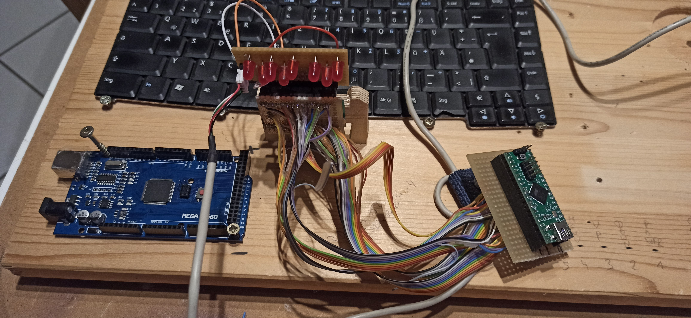

# PiBook_on_AcerTravelMate4001
An Acer Travelmate 4001 WLMI witha dead mainboard becomes alive again with a "Raspberry Pi heart" in it.
An AVR Microcontroller with many I/O pins replaces the keyboard controller, and as we are already there,
replaces the 5 buttons of the Screen controller board.

    
There are easier ways to get a so-called PiBook, but I wanted to figure it out how to do this. 

The details:

a) If possible use the housing of the TravelMate. But maybe there is not enough space.
  - Todo: measure the available space inside the housing and record it here.

## Details of a) can be found in folder \housing if the work is started

b) Use the existing keyboard matrix (german layout, 89 keys, slightly curved).
  Needs one of the bigger Arduinos with many I/O to deal with the 24 matrix pins.
  Currently in use is a full size Arduino Mega2560. A Teensy ++2.0 is also AVR-based and the source is prepared for this tiny 2nd board.
  current state:
  - Done: It detects all 89 keys (needs 24pins)
  - Done: Temporary output of a detected key via UART
  - Done: scan time for the whole keyboard is less than 3ms. No debouncing hard- or software and no delay in use. 
  - Done: Fn-Detection for "special keys" and replacement of the ScreenControl buttons (Fn+F5 = "Power", Fn+F6 = Menu, Fn+F7 = Auto, Fn+ARROW_LEFT = DOWN, Fn+ARROW_RIGHT = UP  
  - Done: key repeat
  - Done: Integrate PS/2 Library for becoming a "homemade PS/2 Keyboard".
  - Done: Code selects the right PS/2 scan codes
  - Done: Control Keyboard LEDs via PS2 signals
   
  
  Pin count: Matrix + LEDs + PS2 + DisplayAdapterKeys = 24(in/out) + 3(out) + 2(in/out) + 5(out) = 34 I/O Pins.
  Enable/Disbale Touchpad will need 1 additional I/O Pin.
  Memory Footprint: Less than 4,5 kBytes Flash and 640 Bytes RAM if macro KBD_DEBUG is not set.
  If your µC provides that much I/O, it probably also provides enough memory. 
  Update to b) with Version 0.1.1: The keyboard.ino code works on a Teensy ++2.0 as good as on a MEGA 2560. As the Teensy ++2.0 is the platform that will be used in that laptop case because of the smaller PCB, 
  there is no advantage on testing it with an Arduino MEGA 2560 in the future. I will focus on Teensy ++2.0 therefore.

++++ Good and bad News 2024-01-14 ++++
I have successfully assembled the keyboard matrix into the old housing and wired everthing, including the PS2-to-USB converter. 
Works nice as a keyboard with an integrated touchpad. No problems so far.
But then it happened...
My solderung iron accidently turned on and while I was busy with finding a solution to extend the hight of the housing, the soldering iron melted some 
of the key caps. This means: The Acer keyboard matrix is not usable anymore. I have some other keyboard matrix here and will continue with one of them.
But none of them fits into the acer housing. So close and now so far...
+++++++++++++++++++++++++++++

Adaption to other keyboards or other Arduinos??? 
All the details about the keyboard are in "ACER_TRAVELMATE4001WLMI_KEYBOARD_MATRIX.h". 
The I/O pins in use are described in PIN_ASSIGNMENTS.h.  
You will need an Arduino with many I/O, for example the classic Arduino Mega or the Mega Pro Mini.
As the PS/2 protocoll runs at 5V, Arduino Mega Pro 3.3V or Arduino Due will need some 5V-to-3,3V Levelshifter for the PS/2 Interface.
Arduino Mega Pro 3.3V also runs at 8MHz only, which is half the speed of the other Arduino MEGAs.
 
## Details of b) can be found in folder \keyboard

  
c) Use the existing Touchpad (TM42PUF), PS/2 out
  As this is already a PS/2 device, it is planned to use a PS/2 to USB converter, which shall handle the "homemade PS/2 keyboard", too.
  These converters look huge, but once pulled out of their housing, they are at the size of an SDCard.
  It is not expected to write any code for this task. The right wiring and maybe some glue logic shall do the job.
  After some use of G**gle, I found a straight foreward video with description how to wire this. Serch Youtube for 
  "How to find pinout for Touchpad/Pointing Stick & connect to Arduino - Synaptics". Instead of using the fiddly flat cable connector,
  the wires can be soldered directly to the PCB using some golden test pads, having names that start with "T". 
  Adding a 4 pin connector with a 2.54 mm spacing glued to the PCB should be no problem.
  
  Working wiring is as follows:
- +5V at T22
- Ground at T23
- Clock at T10
- Data at T11

As this does not influence the keyboard software, currently there is no special release for this.
But be able to enable/disable the Touchpad is quite useful for people like me, who always accidently touch the Touchpad with their thumbs while writing with 6 fingers only,
resulting in writing the right words at the wrong place. Maybe disabling(grounding) the data or clock pin is the way to do that?
  
## Details of c) can be found in folder \Touchpad if the work is started

d) Use the existing screen (1280x800), 15.x inches, "QDI N15W Rev4")
  I buyed a piece of electronic, called "M.NT68676.2" to convert VGA/HDMI/DVI to display signals, including the inverter to power up the CCFL backlight.
  The provided cable is short and might be too short. If it does not fit, I need to adapt the cable from the laptop.
  This needs no code if the keys of that PCB are used. But a smarter solution would be to replace these keys by some output lines of the arduino which is
  already used by the keyboard matrix. Maybe Fn+whatever can trigger such a output line to emulate that keypress.
  Optocoupler to isolate or "Open collector output" with bipolar transistors? Test without µC.
  
  Test with Multimeter: All 5 buttons cause just a simple short to the ground. As the tiny buttons themself can not handly heavy load, I do not expect high current here. 
  Some general purpose NPN Transistors wired as an emitter base circuit with a flyback diode and a base resistor should do the job. Optocoupler are not needed and would 
  not improve the reliability, as ground is still shared between Keyboard µC and ScreenControl.
  
  The Keyboard software is meanwhile prepared to control 5 dedicated I/O lines. For a first go, these buttons are used
  - Fn + F5 = "Power"
  - Fn + F6 = Menu
  - Fn + F7 = Auto
  - Fn + ARROW_LEFT = DOWN
  - Fn + ARROW_RIGHT = UP
 
  The Raspberry Pi provides HDMI output, so we need an HDMI input. DVI and VGA left unused. 
  Meanwhile I have a Raspberry 3B+. Building a C64 Laptop using BMC64 sounds kinda fun...

  - Done: Test with existing Raspberry Pi zero. Picture is shown. PCB works and can be powered using a 12V/2A power supply.
  - ToDo: Prepare bigger 12V Power supply and 5V Step down converter for the Raspberry Pi 3 
  - ToDo: build data cable between display and board if needed.

  New fun: the Invertor provided with the ScreenController does not fit into the laptop lid. Need to figure out how to use the old one.
  
## Details of d) can be found in folder \ScreenController if the work is started

e) Don't use the internal DVD-Writer
  This gives some more space for wiring.
  - ToDo: remove the front of the drive and glue the front of the drive to the housing
  
f) At least add a headphone jack. Reuse internal speakers if possible 
  - ToDo: add headphone jack and wire it to the PCM sound output of the Raspberry pi (RPi Zero does not have this, but this could be added afaik)
  - Optional: Add the pcb of a USB-Soundcard and add a jack for the mike of the usb-soundcard
  - Optional: 5V-powered "class H" stereo amplifier
  - Optional: internal mic
 
g) Use a 12V Power supply so there's no need to deal with the old one that provides 19V
  With this, only a 12V to 5V Step Down Converter is needed. 
  - ToDo: estimate power consumption of all components and search for matching power converters. XL4015 with extra cooler?
  - ToDo: make a plan how to wire this with thicker wires
  
h) If possible (enough space for cable), lead the inputs of the screen accessing board to the outside of this "PiBook", so the whole thing can be used as a KVM (Keyboard+Video+Mouse).
    For this, do the same for keyboard and touchpad (USB,PS/2, both?)

i) Temperatur and Voltage Monitoring (No planned)
  
j) How to power on/off the Rapberry Pi? 
	Can the Keyboard-Arduino be of any help with this task? Linux shell via UART? Attention: Arduino is 5V, Pi is 3.3 V!
	How to completely power off? This computer shall not boot on powering, but power on if the power button is pressed.
	- ToDo: Check if there is any prebuild hardware available for this.
 	- PS/2 keyboard can send an ACPI Power on code.

h) Add a Realtime clock. There are tiny boards available for the Raspberry Pi, but most of them seem to deal with a capacitor.
	- ToDo: use existing RTC Board, get this working for the Pi Zero, and estimate the time span it can keep the clock alive. Maybe a CR2032 will work better?
	
## Details of e)...h) can be found in folder \additional if the work is started

